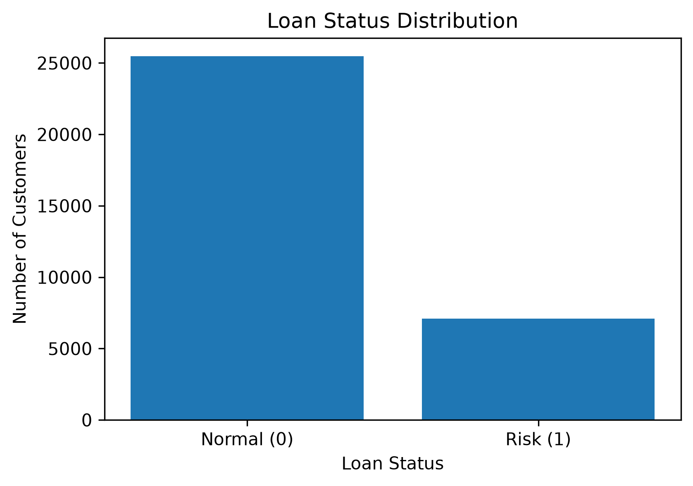
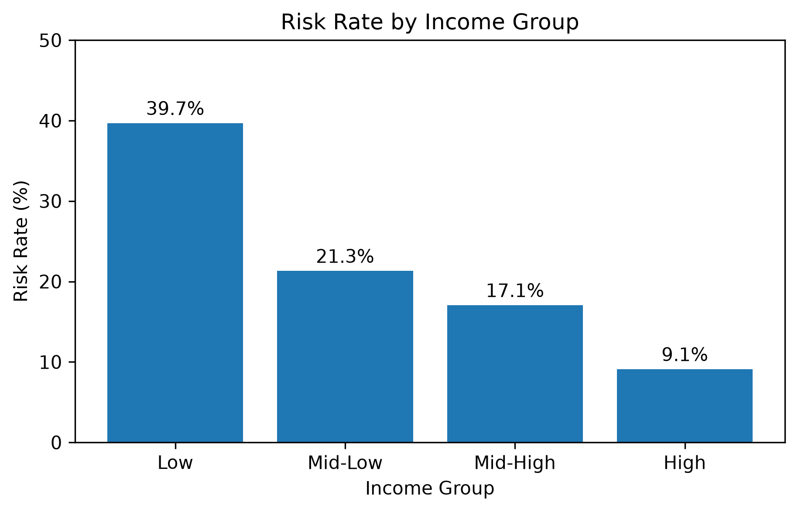
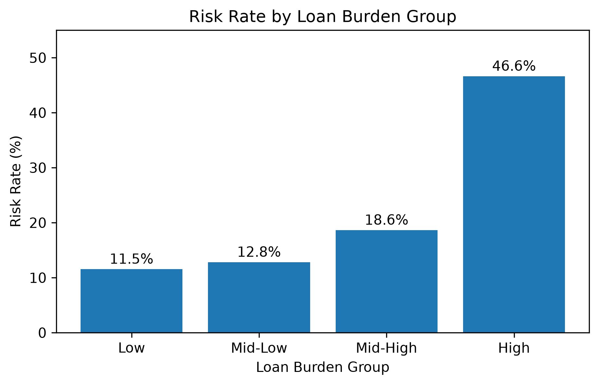
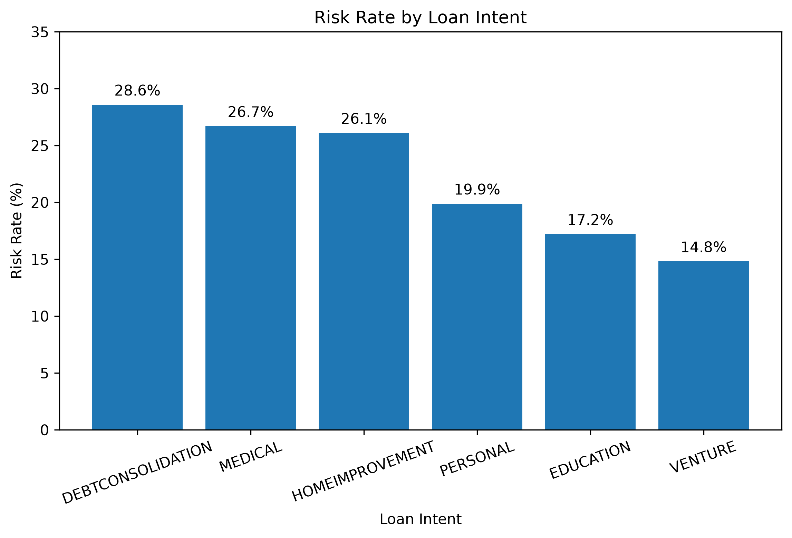
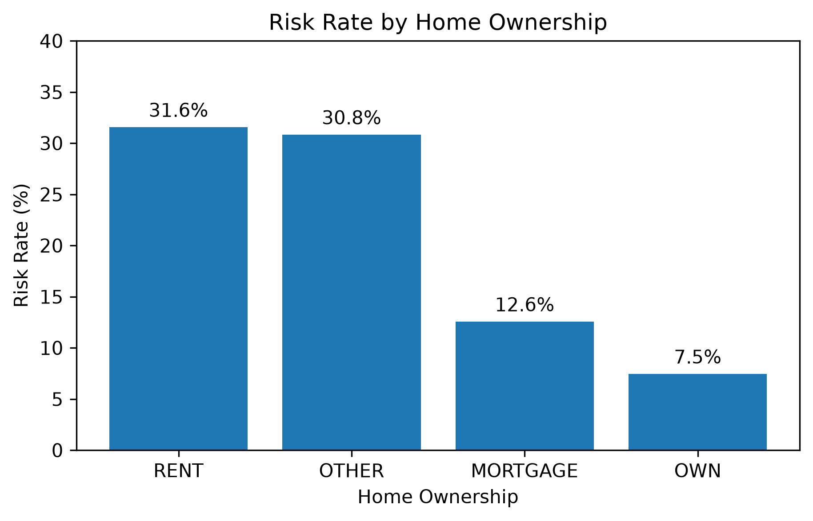
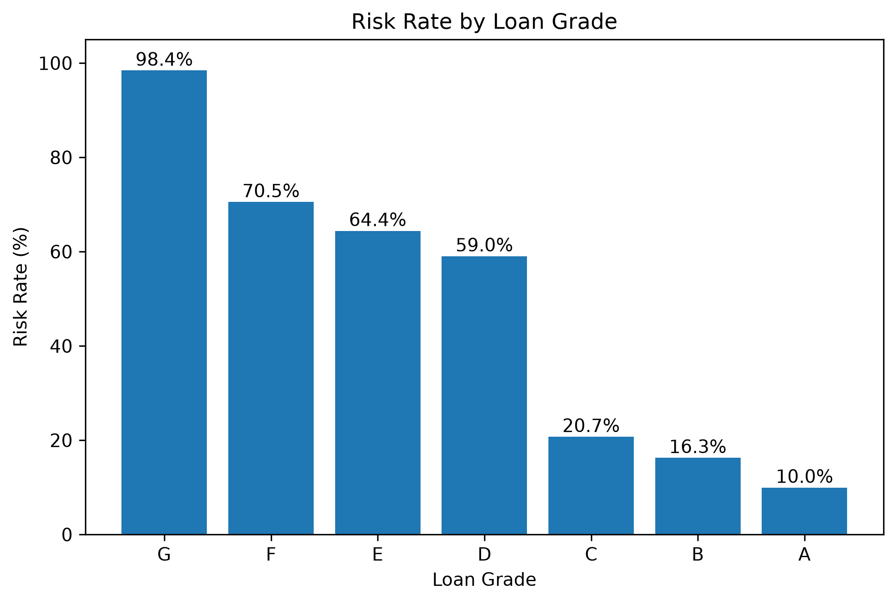

## 9. 분석 결과 시각화

### 9-1. 전체 대출 상태 분포

정상 고객과 위험 고객의 전체 분포를 확인했습니다.

### 9-2. 소득 구간별 위험률

소득 구간별 위험률을 비교한 결과, 저소득 구간의 위험률이 가장 높고 고소득 구간의 위험률이 가장 낮게 나타났습니다.

### 9-3. 대출 부담률별 위험률

대출 부담률이 높은 구간에서 위험률이 크게 증가했습니다. 특히 가장 높은 부담률 구간의 위험률은 46.6%로 나타났습니다.

### 9-4. 대출 목적별 위험률

대출 목적별로 위험률에 차이가 나타났으며, 부채 통합 목적의 위험률이 가장 높았습니다.

### 9-5. 주택 소유 형태별 위험률

임대 고객군의 위험률이 상대적으로 높고, 자가 보유 고객군의 위험률은 낮게 나타났습니다.

### 9-6. 대출 등급별 위험률

대출 등급별 위험률을 비교한 결과, A등급에서 G등급으로 갈수록 위험률이 크게 높아지는 경향이 나타났습니다.